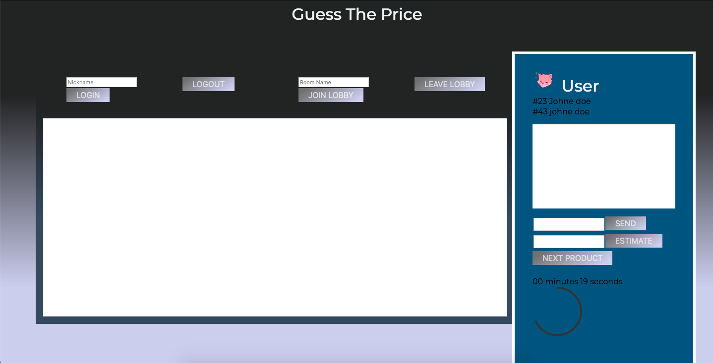

## Frontend Update:

to connect your own database with the app, you need to create a .env file

.env:

COMPOSE_PROJECT_NAME="name-of-image"
MYSQL_PASSWORD=examplepw
MYSQL_ROOT_PASSWORD=examplepw
MYSQL_USER=exampleuser
MYSQL_DATABASE=exampledb
